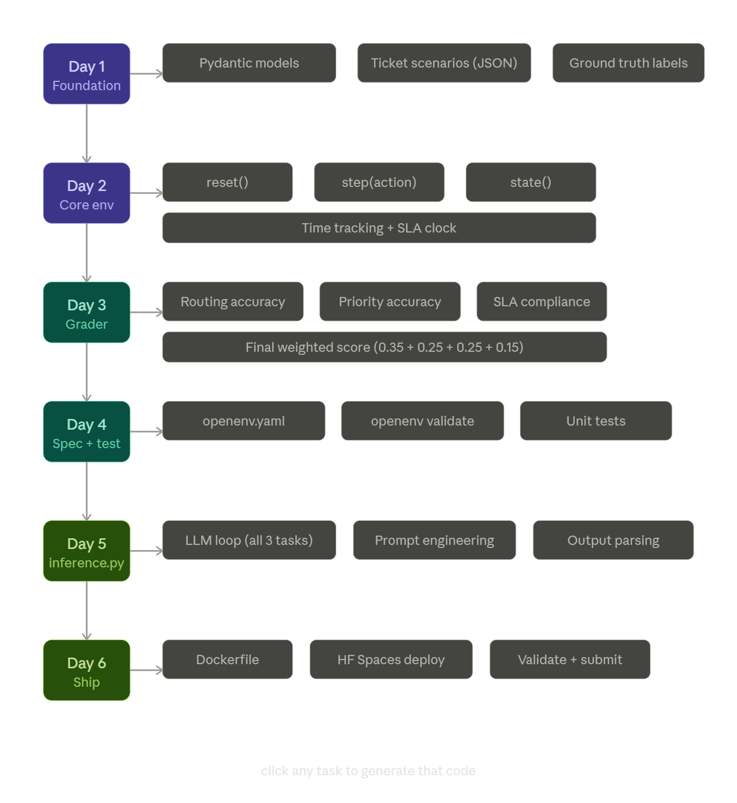

🧠 1. Core Objective The agent acts as a support triage system.

Given: Incoming customer tickets

It must:

Assign: Department (billing / tech / general) Priority (low / medium / high) Action (resolve / escalate / request info)

Goal: Maximize correct routing + minimize SLA violations + handle critical issues first

⚙️ 2. Observation (State Design)

Each step provides:

Ticket fields: id category_hint (noisy signal) description (optional text) urgency (1–5) customer_tier (free / premium) time_waiting System state: current_time pending_tickets resolved_tickets 🎮 3. Action Space

Each action:

(ticket_id, department, priority, action_type)

Where:

department: billing technical general priority: low / medium / high action_type: resolve escalate request_info 🔁 4. Environment Dynamics

Each step:

Agent picks a ticket Assigns decision System updates: ticket removed or updated time increases new tickets may arrive (medium/hard) 🎯 5. Tasks (Must Be Clearly Different) 🟢 Easy 5–8 tickets Correct category_hint mostly accurate No new arrivals

👉 Tests classification + basic routing

🟡 Medium 10–15 tickets Noisy category_hint Some new tickets arrive SLA pressure begins

👉 Tests prioritization

🔴 Hard 20+ tickets High noise in category Continuous inflow Limited steps

👉 Tests optimization + tradeoffs

📏 6. Grader (MOST IMPORTANT PART)

Must be:

deterministic reproducible normalized (0–1) Metrics

Routing Accuracy (department) correct_department / total
Priority Accuracy correct_priority / total
SLA Compliance High urgency handled quickly sla_score = 1 - (late_high_priority / total_high_priority)
Action Correctness resolve vs escalate vs request_info Final Score score = 0.35 * routing_accuracy + 0.25 * priority_accuracy + 0.25 * sla_score + 0.15 * action_accuracy
👉 Clean, explainable, judge-friendly

⚙️ 7. Reward Function (Dense)

You need step-level reward, not just final score.

Positive: Correct department → +0.2 Correct priority → +0.15 Correct action → +0.1 Negative: Wrong department → −0.3 Ignoring urgent ticket → −0.5 Delay penalty → −0.05 * time 🔥 8. What Makes This WINNING ✔ Real-world utility (30%) This is literally used in Zendesk / Freshdesk systems ✔ Strong graders (25%) Fully deterministic Multi-metric ✔ Good reward shaping (20%) Not sparse Step-level signals ⚠️ Critical Pitfalls to Avoid ❌ Weak version (loses points): Just classify ticket → done ✅ Strong version: Multi-step decision Time pressure Tradeoffs

Project Structure 
support-triage-env/
│
├── env/
│   ├── __init__.py
│   ├── environment.py        # core env class
│   ├── models.py             # Pydantic models
│   ├── grader.py             # scoring logic
│   └── tickets.py            # hardcoded ticket scenarios
│
├── tasks/
│   ├── easy.json             # 5-8 tickets, clean signals
│   ├── medium.json           # 10-15 tickets, noisy
│   └── hard.json             # 20+ tickets, chaos
│
├── tests/
│   ├── test_environment.py
│   ├── test_grader.py
│   └── test_tasks.py
│
├── inference.py              # LLM agent runner
├── openenv.yaml              # spec metadata
├── Dockerfile
├── requirements.txt
└── README.md

What to Build Each Day
Day 1 — Foundation
No code yet. Write the ticket scenarios as JSON by hand. Define ground truth labels for every ticket. This is the creative work — get it right here and everything else becomes mechanical.
Day 2 — Core environment
Build environment.py with the three methods. Hardcode the easy task first, get one full loop working end to end on your laptop. Don't touch medium/hard until easy works perfectly.
Day 3 — Grader
Build grader.py with all four metrics separately, then combine into the weighted score. Test it manually against your hardcoded ground truth before wiring it to the env.
Day 4 — Spec + tests
Add Pydantic models to models.py, write openenv.yaml, run the validator. Write at least basic unit tests so you catch regressions when you touch the grader later.
Day 5 — inference.py
Connect an LLM to your environment. This is mostly prompt engineering — how you describe the ticket to the LLM and how you parse its response into a valid Action object.
Day 6 — Ship
Dockerfile, HF Spaces deploy, final validation run, submit. Leave a full day for this — Docker always has surprises.